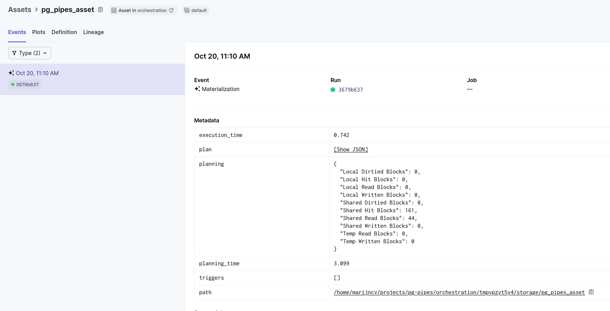

# pg-pipes

An implementation of the [dagster-pipes](https://docs.dagster.io/concepts/dagster-pipes) protocol using [pgrx](https://github.com/pgcentralfoundation/pgrx) to report an asset materialization from a PostgreSQL user defined function. Inspired by:
* https://github.com/pgcentralfoundation/pgrx/tree/develop/pgrx-examples/bad_ideas
* https://github.com/dagster-io/dagster/tree/master/examples/experimental/external_assets/pipes/rust_check

The `pg_pipes` extension exposes a `pipes_session` postgres UDF that takes a query, calls `EXPLAIN ANALYZE` on it, and reports an `AssetMaterialization` with the query the plan & execution details as metadata.

## Example

The `pipes_session` can be invoked from a Dagster orchestration process like this:

```python
from typing import Iterator, Union
from pathlib import Path

from dagster import (
    AssetExecutionContext,
    PipesTempFileContextInjector,
    PipesTempFileMessageReader,
    MaterializeResult,
    AssetCheckResult,
    asset,
    open_pipes_session,
)
import psycopg2

@asset
def pg_pipes_asset(context: AssetExecutionContext) -> Iterator[Union[MaterializeResult, AssetCheckResult]]:
    with open_pipes_session(
        context=context,
        context_injector=PipesTempFileContextInjector(),
        message_reader=PipesTempFileMessageReader(),
    ) as pipes_session:

        context_path = pipes_session.context_injector_params["path"]
        messages_path = pipes_session.message_reader_params["path"]
        query = "SELECT * FROM pg_tables"

        conn = psycopg2.connect(
            database="pg_pipes",
            host=Path.home() / ".pgrx",
            port=28813
        )

        cursor = conn.cursor()

        # make sure the extension is enabled
        cursor.execute("drop extension if exists pg_pipes; create extension pg_pipes;")

        # start the pipes_session in postgres
        cursor.execute(f"select pipes_session('{context_path}', '{messages_path}', '{query}');")

    yield from pipes_session.get_results()
```

The Dagster event log will now contain the `ASSET_MATERIALIZATION` event plus the query plan & execution information as metadata:



## Get Started

### PostgreSQL & pgrx

Follow the [system requirements](https://github.com/pgcentralfoundation/pgrx?tab=readme-ov-file#system-requirements) instructions from the pgrx installation docs.

Then install `cargo-pgrx` and use it to install a postgres instance that we can load our extension into:
```bash
cd pg_pipes
cargo install --locked cargo-pgrx
cargo pgrx init --pg13=download
```

Now we can start the instance with our extension:
```bash
cargo pgrx run
```

### Dagster

Follow the [pdm installation](https://pdm-project.org/en/latest/#installation) instructions.

Then install & activate:
```bash
cd orchestration
pdm install
eval $(pdm venv activate)
```

Now start Dagster with:
```bash
dagster dev -m orchestration 
```
